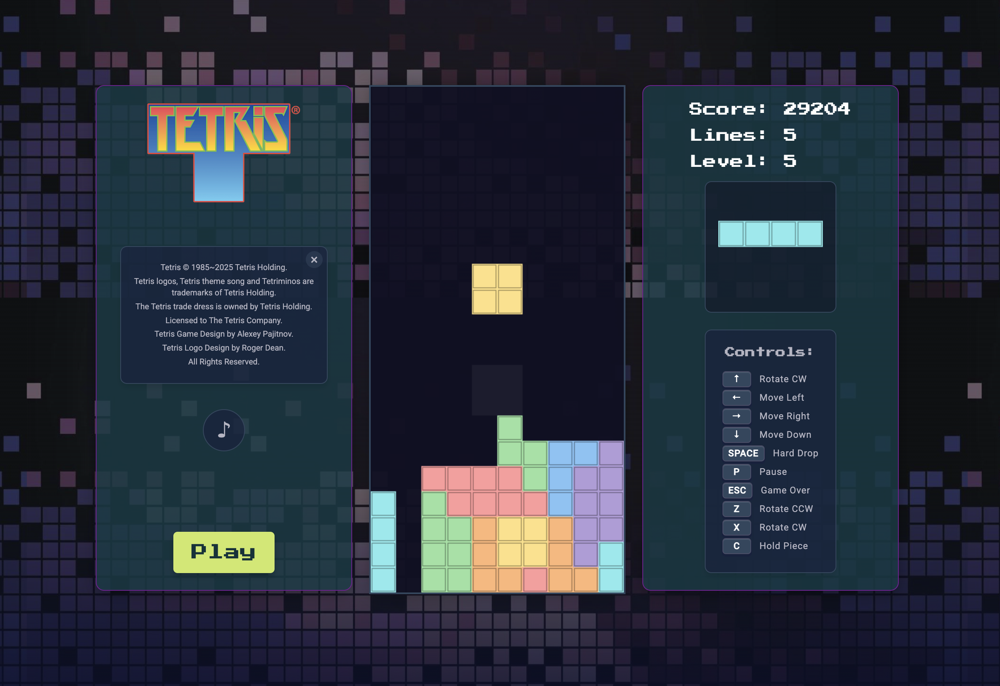
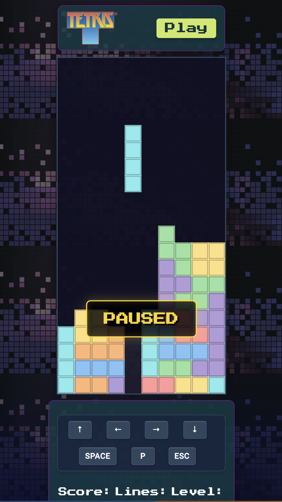

# My Tetris

A modern, responsive Tetris game built with vanilla JavaScript, HTML, and CSS.  
The game includes sound effects, keyboard controls, and adapts to both desktop and mobile screen sizes.


  


## Features

- Classic Tetris gameplay mechanics
- Responsive design for both desktop and mobile
- Modern visual effects and animations
- Score tracking and level progression
- Next piece preview
- Piece holding system
- Ghost piece preview
- "Game Over" screen with the ability to restart the game
- Sound effects and background music
- Touch controls for mobile devices

## Controls

### How to Play

- Click **Play** to start a new game.
- Use arrow keys to move and rotate blocks:
  - **⬅️ Left Arrow** — Move left
  - **➡️ Right Arrow** — Move right
  - **⬇️ Down Arrow** — Soft drop
  - **⬆️ Up Arrow** — Rotate
  - **Spacebar** — Quick drop

### Game Rules

- Clear lines by completing them horizontally
- Each cleared line gives points
- The game speeds up with each level (every 10 lines cleared)
- Game over occurs if pieces stack to the top

### Scoring System

| Action           | Points (× level) |
| ---------------- | ---------------- |
| Single line      | 100              |
| Double line      | 300              |
| Triple line      | 500              |
| Tetris (4 lines) | 800              |
| Soft drop        | +1 per cell      |
| Hard drop        | +2 per cell      |

## Technologies Used

- HTML Canvas for rendering the board and pieces
- JavaScript for game logic and interactions
- CSS for layout and animations
- Web Audio API for sound effects and music

## Installation & Run Locally

1. Clone the repository:

```bash
git clone https://github.com/yourusername/my-tetris.git
```

2. Make sure you have Node.js installed.

3. Start the local server:

```bash
node html_server.js
```

4. Open your browser and navigate to:

```bash
http://localhost:8080
```

## License

This project is for educational and personal use as part of Qwasar School projects.
Tetris® is a registered trademark of The Tetris Company.
All trademark information is included in the game start screen.

## The Core Team

### Author

Katrina Pastore Ozolina
Qwasar Project: My Tetris Game

<span><i>Made at <a href='https://qwasar.io'>Qwasar SV -- Software Engineering School</a></i></span>
<span></span>
